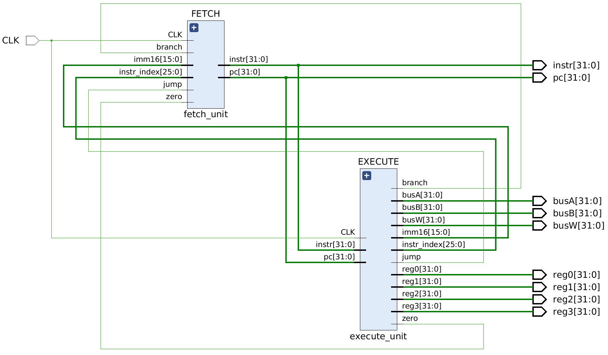
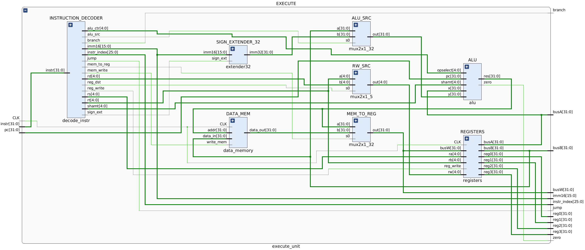

# MIPS Processor
A MIPS ISA based processor designed for the course Introduction to Processor Architecture.

## Architecture

###### Overall Design
  
###### Fetch

###### Execute

## Features
* 2-stage **pipelined** processor, with the following stages
	* Fetch
	* Execute
* 1 Branch Delay Slot
* Replicates the **Harvard** architecture, with **separate** data and instruction memories
* Instruction & Data Memory
	* **1KB** each: **1024 x 1** _byte_
	* Each slot is of 8-bit width
	* Extensible to **16KB**: **4096 x 4** _bytes_
* Has 32 **32-bit** registers 
* Supports **R**, **I** & **J** type instructions. Full list of supported instructions is given below

## ALU
The ALU takes in 2 **32-bit** inputs and the control signals, to give a **32-bit** output. The opcode to operation matching used is shown below:
| Operation Code |   Operation        |
|:--------------:|:------------------:|
|     00000      |Add                 | 
|     00001      |Subtract            | 
|     00010      |Less Than _**signed**_    |  
|     00011      |Shift Right _**signed src: rs**_ |
|     00100      |Shift Left **_src: rs_** |
|     00101      |Shift Left **_src: shamt_** | 
|     00110      |Greater Than _**signed**_ |
|     00111      |Less Than _**unsigned**_  | 
|     01000      |Equal To            | 
|     01001      |AND                 | 
|     01010      |OR                  | 
|     01011      |Shift Right **_signed src: shamt_**    |
|     01100      |NOR                 |
|     01101      |XOR                 |
|     01110      |Shift Right _**unsigned src: rs**_       |
|     01111      |Shift Right _**unsigned src: shamt**_    |
|     10000      |Less Than Equal _**signed**_ | 
|     10001      |Greater Than Equal _**signed**_ | 
|     10010      |Not Equal           |  
|     10011      |JAL(Add 8)          |

## Instructions Supported
#### R-Type
###### ADD 
| Special | R1 | R2 | R3 |   0   |  ADD   |
|:-------:|:--:|:--:|:--:|:-----:|:------:|
| 000000  | rs | rt | rd | 00000 | 100000 |

**Format**: `ADD rd, rs, rt`    
**Purpose**: `To add 32-bit integers.`
#

###### AND
| Special | R1 | R2 | R3 |   0   |  AND   |
|:-------:|:--:|:--:|:--:|:-----:|:------:|
| 000000  | rs | rt | rd | 00000 | 100100 |

**Format**: `AND rd, rs, rt`    
**Purpose**: `To do a bitwise logical AND.`
#

###### NOR 
| Special | R1 | R2 | R3 |   0   |  NOR   |
|:-------:|:--:|:--:|:--:|:-----:|:------:|
| 000000  | rs | rt | rd | 00000 | 100111 |

**Format**: `NOR rd, rs, rt`    
**Purpose**: `To do a bitwise logical NOR.`
#

###### OR 
| Special | R1 | R2 | R3 |   0   |   OR   |
|:-------:|:--:|:--:|:--:|:-----:|:------:|
| 000000  | rs | rt | rd | 00000 | 100101 |

**Format**: `OR rd, rs, rt`    
**Purpose**: `To do a bitwise logical OR.`
#

###### SUB
| Special | R1 | R2 | R3 |   0   |  SUB   |
|:-------:|:--:|:--:|:--:|:-----:|:------:|
| 000000  | rs | rt | rd | 00000 | 100010 |

**Format**: `SUB rd, rs, rt`    
**Purpose**: `To subtract 32-bit integers.`
#

###### XOR 
| Special | R1 | R2 | R3 |   0   |  XOR   |
|:-------:|:--:|:--:|:--:|:-----:|:------:|
| 000000  | rs | rt | rd | 00000 | 100110 |

**Format**: `XOR rd, rs, rt`    
**Purpose**: `To do a bitwise logical Exclusive OR.`
#

###### SLT 
| Special | R1 | R2 | R3 |   0   |  SLT   |
|:-------:|:--:|:--:|:--:|:-----:|:------:|
| 000000  | rs | rt | rd | 00000 | 101010 |

**Format**: `SLT rd, rs, rt`    
**Purpose**: `Set on Less Than`
#

###### SRA 
| Special |   0   | R1 | R2 |   Shift   |  SRA   |
|:-------:|:-----:|:--:|:--:|:-----:|:------:|
| 000000  | 00000 | rt | rd |   sa  | 000011 |

**Format**: `SRA rd, rt, sa`    
**Purpose**: `To execute an arithmetic right-shift of a word by a fixed number of bits.`
#

###### SRAV
| Special | R1 | R2 | R3 |   0   |  SRAV  |
|:-------:|:--:|:--:|:--:|:-----:|:------:|
| 000000  | rs | rt | rd | 00000 | 000111 |

**Format**: `SRAV rd, rt, rs`    
**Purpose**: `To execute an arithmetic right-shift of a word by a variable number of bits.`
#

###### SRL
| Special |   0   | R1 | R2 |   Shift   |  SRL   |
|:-------:|:-----:|:--:|:--:|:-----:|:------:|
| 000000  | 00000 | rt | rd |   sa  | 000010 |

**Format**: `SRL rd, rt, sa`    
**Purpose**: `To execute a logical right-shift of a word by a fixed number of bits.`
#

###### SRLV 
| Special | R1 | R2 | R3 |   0   |  SRLV  |
|:-------:|:--:|:--:|:--:|:-----:|:------:|
| 000000  | rs | rt | rd | 00000 | 000110 |

**Format**: `SRLV rd, rt, rs`   
**Purpose**: `To execute a logical right-shift of a word by a variable number of bits.`
#

###### SLL
| Special |   0   | R1 | R2 |   Shift   |  SLL   |
|:-------:|:-----:|:--:|:--:|:-----:|:------:|
| 000000  | 00000 | rt | rd |   sa  | 000000 |

**Format**: `SLL rd, rt, sa`    
**Purpose**: `Shift Word Left Logical`
#

###### SLTU
| Special | R1 | R2 | R3 |   0   |  SLTU  |
|:-------:|:--:|:--:|:--:|:-----:|:------:|
| 000000  | rs | rt | rd | 00000 | 101011 |

**Format**: `SLTU rd, rs, rt`     
**Purpose**: `Set on Less Than Unsigned`
#

#### I-Type
###### ADDI
|  ADDI  | R1 | R2 | imm16 |
|:------:|:--:|:--:|:---------:|
| 001000 | rs | rt | immediate |

**Format**: `ADDI rt, rs, immediate`   
**Purpose**: `ADD Immediate`
#

###### ANDI 
|  ANDI  | R1 | R2 | imm16 |
|:------:|:--:|:--:|:---------:|
| 001100 | rs | rt | immediate |

**Format**: `ANDI rt, rs, immediate`   
**Purpose**: `AND Immediate`
#

###### XORI
|  XORI  | R1 | R2 | imm16 |
|:------:|:--:|:--:|:---------:|
| 001110 | rs | rt | immediate |

**Format**: `XORI rt, rs, immediate`   
**Purpose**: `Exclusive OR Immediate`
#

###### ORI 
|  ORI  | R1 | R2 | imm16 |
|:------:|:--:|:--:|:---------:|
| 001101 | rs | rt | immediate |

**Format**: `ORI rt, rs, immediate`   
**Purpose**: `To do a bitwise logical OR with a constant.`
#

###### SLTI 
|  SLTI  | R1 | R2 | imm16 |
|:------:|:--:|:--:|:---------:|
| 001010 | rs | rt | immediate |

**Format**: `SLTI rt, rs, immediate`   
**Purpose**: `Set on Less Than Immediate`
#

###### SLTIU 
|  SLTIU | R1 | R2 | imm16 |
|:------:|:--:|:--:|:---------:|
| 001011 | rs | rt | immediate |

**Format**: `SLTIU rt, rs, immediate`   
**Purpose**: `Set on Less Than Immediate Unsigned`
#

###### BEQ 
|  BEQ  | R1 | R2 | imm16 |
|:------:|:--:|:--:|:---------:|
| 000100 | rs | rt | offset |

**Format**: `BEQ rs, rt, offset`   
**Purpose**: `Branch on Equal`
#

###### BGTZ 
|  BGTZ  | R1 | 0 | imm16 |
|:------:|:--:|:--:|:---------:|
| 000111 | rs | 00000 | offset |

**Format**: `BGTZ rs, offset`   
**Purpose**: `Branch on Greater Than Zero`
#

###### BLEZ
|  BLEZ  | R1 | 0 | imm16 |
|:------:|:--:|:--:|:---------:|
| 000110 | rs | 00000 | offset |

**Format**: `BLEZ rs, offset`   
**Purpose**: `Branch on Less Than or Equal to Zero`
#

###### BNE 
|  BNE  | R1 | R2 | imm16 |
|:------:|:--:|:--:|:---------:|
| 000101 | rs | rt | offset |

**Format**: `BNE rs, rt, offset`   
**Purpose**: `Branch on Not Equal`
#

###### LB
|  LB  | R1 | R2 | imm16 |
|:------:|:--:|:--:|:---------:|
| 100000 | base | rt | offset |

**Format**: `LB rt, offset(base)`   
**Purpose**: `Load byte`
#

###### SB
|  SB  | R1 | R2 | imm16 |
|:------:|:--:|:--:|:---------:|
| 101000 | base | rt | offset |

**Format**: `SB rt, offset(base)`   
**Purpose**: `Store byte`
#

#### J-Type
###### J
|  J     | imm26      |
|:------:|:----------:|
| 000010 | instr_index|

**Format**: `J target`   
**Purpose**: `Jump`
#

###### JAL
|  JAL   | imm26      |
|:------:|:----------:|
| 000011 | instr_index|

**Format**: `J target`   
**Purpose**: `Jump and Link`
#

## Assembler
Code can be written in assembly, using the instruction set provided above. The [assembler](src/assembler/assembler.py) written will convert it into machine code, which can then be loaded into the instruction memory.   
###### TO-DO 
- [x] Translate basic instructions   
- [ ] Work with code having labels   
- [ ] Automatically substitute address line numbers from labels

## Running
This processor can be run on Xilinx Vivado or Xilinx ISE. It is, however, preferable to use Vivado.  
To run,
- Write the assembly code for the program to be run
- Use the assembler to convert the program into machine code
- Load all the source verilog files into a Vivado/ISE project
- Load the generated machine code into the instruction memory
- Simulate the project using Vivado/ISE, or generate the binary to dump onto a board

## References
- [MIPS ISA](https://s3-eu-west-1.amazonaws.com/downloads-mips/documents/MD00086-2B-MIPS32BIS-AFP-05.04.pdf)
- Introduction to Processor Architecture, Spring'20, IIIT-H

## Author(s)
- [Ahish](https://www.github.com/Ahish9009)
